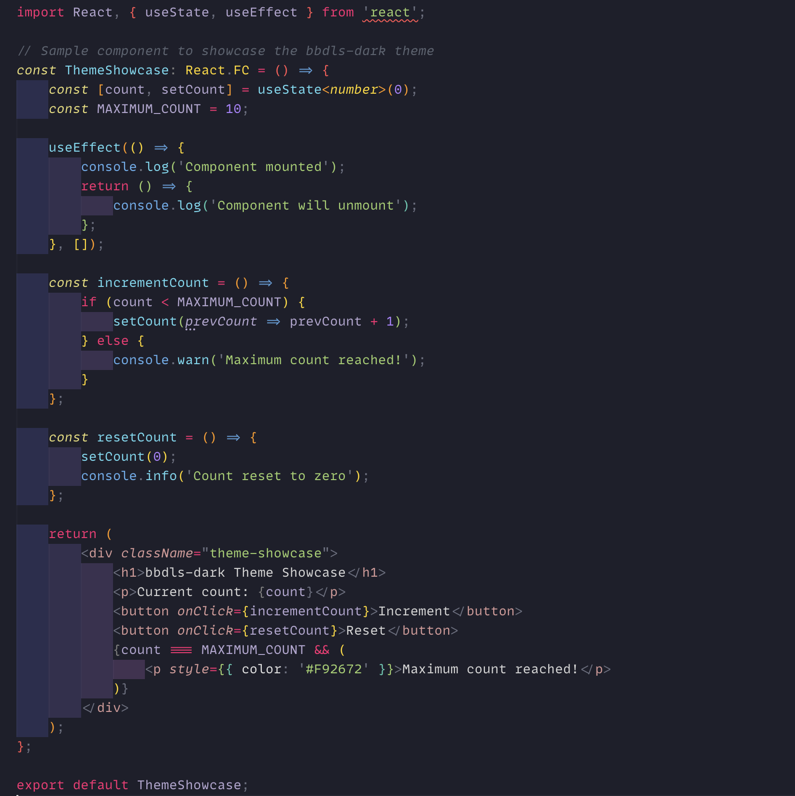

# bbdls-dark VS Code/Cursor Theme

A color scheme born from [**_FEYNCHAT's_**](https://feyn.chat) mind, which decided it was time to spruce up its own user interface.

## Features

- Created by asking [**_FEYNCHAT_**](https://feyn.chat) to create a scientifically-informed, dark mode theme for VSCode that prioritizes readability and coding efficiency ("_prompt engineering_")
- Carefully selected color palette based on color theory principles (according to it atleast)
- Optimized for code readability and reduced eye fatigue (supposedly)
- Matches the code display colors used in dark mode on [**_FEYNCHAT_**](https://feyn.chat)
- Engineered through iterative refinement using AI assistance from [**_FEYNCHAT_**](https://feyn.chat)

## Color Scheme Analysis

Here's a breakdown [**_FEYNCHAT_**](https://feyn.chat) gave about its color choices, designed to enhance readability and reduce eye strain:

1. Dark Background (#1E1F2B): Easier on the eyes for extended coding sessions, reducing overall screen glare.

2. High Contrast: Light foreground (#E0E0E0) against the dark background for improved readability.

3. Color Differentiation:
   - Keywords: #F92672 (bright pink) for easy identification of language constructs

   - Strings: #9ECE6A (soft green) to clearly distinguish text content

   - Functions: #66D9EF (bright blue) for quick recognition of method calls

   - Variables: #61AFEF (lighter blue) to differentiate from functions while maintaining a cohesive look

   - Constants: #AE81FF (purple) to highlight immutable values

4. Muted Colors: Secondary elements use subdued colors to avoid visual clutter.
5. Selective Use of Italics: Enhances visual hierarchy for certain code elements.
6. Harmonious Color Palette: Carefully selected to be visually pleasing and reduce eye fatigue.
7. Error Highlighting: Bright colors for errors to ensure quick identification of issues.
8. Subdued Comments: Muted gray to de-emphasize while maintaining readability.

This color scheme balances visual comfort with code comprehension, optimized for long coding sessions.

## Theme Samples

Here are some examples of how the bbdls-dark theme looks with different programming languages:

### Go

### React

### Python

## Development Process

This theme was developed through an AI-assisted process:

1. Started with a base VS Code theme schema
2. Used [**_FEYNCHAT_**](https://feyn.chat) as a brainstorming tool for color ideas
3. Provided prompts to the AI, such as:
   - "Suggest colors for a dark mode VSCode theme focusing on readability"
   - "Recommend a color scheme that might be suitable for long coding sessions"
4. Iteratively refined the theme based on a combination of AI suggestions and personal preferences
5. Used [**_FEYNCHAT_**](https://feyn.chat) to get explanations for potential color choices

The result is a theme that explores the concept of AI-assisted design while relying on human judgment for final decisions. The color scheme analysis provided earlier in this README is a combination of AI-generated explanations and human interpretation, demonstrating one approach to collaborative theme development.

Note: [**_FEYNCHAT_**](https://feyn.chat) was used in the process, the effectiveness of the theme is subjective and may vary based on individual preferences and needs.

## Installation

### VS Code

1. Copy the entire theme folder into:
   `<user home>/.vscode/extensions`

2. Reload VS Code window:
   - Open the Command Palette (Cmd+Shift+P on Mac, Ctrl+Shift+P on Windows/Linux)
   - Type "Reload Window" and select the option
   - VS Code will restart and apply the new theme
3. Select the theme:
   - Go to File > Preferences > Color Theme
   - Or use the shortcut (Ctrl+K Ctrl+T) or (Cmd+K Cmd+T)
   - Choose "bbdls-dark"

### Cursor

1. Copy the theme folder into:
   `<user home>/.cursor/extensions` 

2. Reload VS Code window:
   - Open the Command Palette (Cmd+Shift+P on Mac, Ctrl+Shift+P on Windows/Linux)
   - Type "Reload Window" and select the option
   - Cursor will restart and apply the new theme
3. Select the theme:
   - Use the shortcut (Ctrl+R Ctrl+T) or (Cmd+R Cmd+T)
   - Choose "bbdls-dark"

## Development

The main theme file is:
`themes/bbdls-dark-color-theme.json`

To make changes:
1. Edit the theme JSON file
2. Changes are automatically applied to the Extension Development Host window
3. Use "Developer: Inspect Editor Tokens and Scopes" command to examine token scopes

## About

Created by chatting with [**_FEYNCHAT_**](https://feyn.chat), demonstrating weird use cases of LLMs such as asking for color codes for design.

This theme is primarily intended for internal use at [bbdeeplearning.systems](https://bbdeeplearning.systems) and for the dispplay of code in [**_FEYNCHAT's_**](https://feyn.chat) responses in dark mode.

For more information on building VS Code themes, see the [color theme documentation](https://code.visualstudio.com/api/extension-guides/color-theme).

## License

This theme is licensed under the MIT License. See the [LICENSE](LICENSE.MD) file for details.
